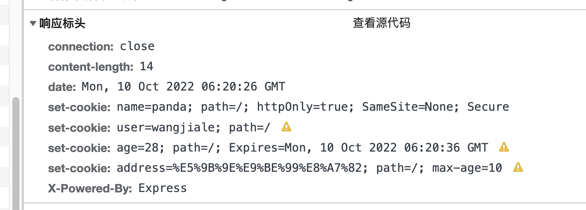

# 浏览器系列之 Cookie

Domain

> Domain 指定了 Cookie 可以送达的主机名。假如没有指定，那么默认值为当前文档访问地址中的主机部分（但是不包含子域名）。像淘宝首页设置的 Domain 就是 .taobao.com，这样无论是 a.taobao.com 还是 b.taobao.com 都可以使用 Cookie。在这里注意的是，不能跨域设置 Cookie，比如阿里域名下的页面把 Domain 设置成百度是无效的：

Path
Path 指定了一个 URL 路径，这个路径必须出现在要请求的资源的路径中才可以发送 Cookie 首部。比如设置 Path=/docs，/docs/Web/ 下的资源会带 Cookie 首部，/test 则不会携带 Cookie 首部。

Domain 和 Path 标识共同定义了 Cookie 的作用域：即 Cookie 应该发送给哪些 URL。

---

Secure 属性

> 标记为 Secure 的 Cookie 只应通过被 HTTPS 协议加密过的请求发送给服务端。使用 HTTPS 安全协议，可以保护 Cookie 在浏览器和 Web 服务器间的传输过程中不被窃取和篡改。

---

HTTPOnly

> 设置 HTTPOnly 属性可以防止客户端脚本通过 document.cookie 等方式访问 Cookie，有助于避免 XSS 攻击。

---

SameSite

> 》SameSite 是最近非常值得一提的内容，因为 2 月份发布的 Chrome80 版本中默认屏蔽了第三方的 Cookie，这会导致阿里系的很多应用都产生问题，为此还专门成立了问题小组，推动各 BU 进行改造。

我们先来看看这个属性的作用：

SameSite 属性可以让 Cookie 在跨站请求时不会被发送，从而可以阻止跨站请求伪造攻击（CSRF）。

属性值
SameSite 可以有下面三种值：

Strict 仅允许一方请求携带 Cookie，即浏览器将只发送相同站点请求的 Cookie，即当前网页 URL 与请求目标 URL 完全一致。
Lax 允许部分第三方请求携带 Cookie
None 无论是否跨站都会发送 Cookie

之前默认是 None 的，Chrome80 后默认是 Lax。

跨域和同站
首先要理解的一点就是跨站和跨域是不同的。同站(same-site)/跨站(cross-site)」，但是与浏览器同源策略（SOP）中的「同源(same-origin)/跨域(cross-origin)」是完全不同的概念。

浏览器同源策略

> 同源策略的同源是指两个 URL 的协议/主机名/端口一致

同源策略作为浏览器的安全基石，其「同源」判断是比较严格的，相对而言，Cookie 中的「同站」判断就比较宽松：只要两个 URL 的 eTLD+1 相同即可，不需要考虑协议和端口。其中，eTLD 表示有效顶级域名，注册于 Mozilla 维护的公共后缀列表（Public Suffix List）中，例如，.com、.co.uk、`.github.io` 等。eTLD+1 则表示，有效顶级域名+二级域名，例如 taobao.com 等。

举几个例子，www.taobao.com 和 www.baidu.com 是跨站，www.a.taobao.com 和 www.b.taobao.com 是同站，a.github.io 和 b.github.io 是跨站(注意是跨站)。

SameSite 值是 Lax, 那么在发送同站请求的时候会带上 Cookie。那么跨站请求会不会带呢？

设置 `SameSite=None` 时，必须同时设置 `Secure` 属性

嵌入 iframe ，子页面与顶级导航 Top 跨站，子页面发起请求以下 node 服务

