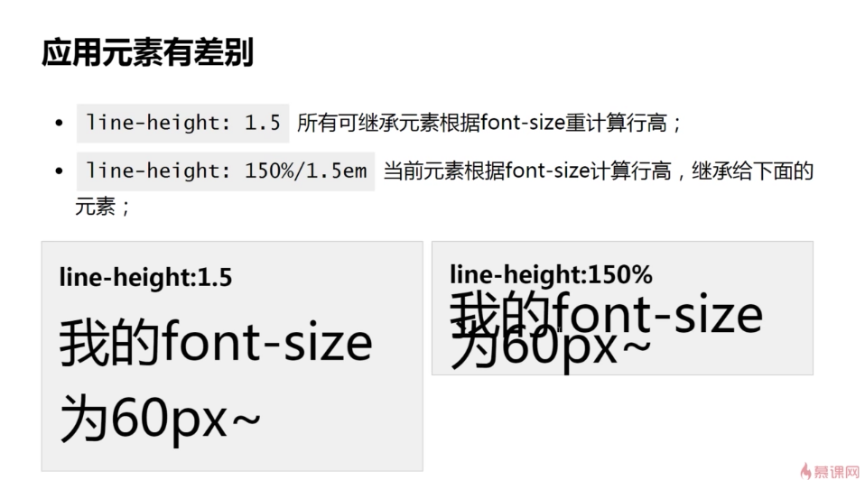
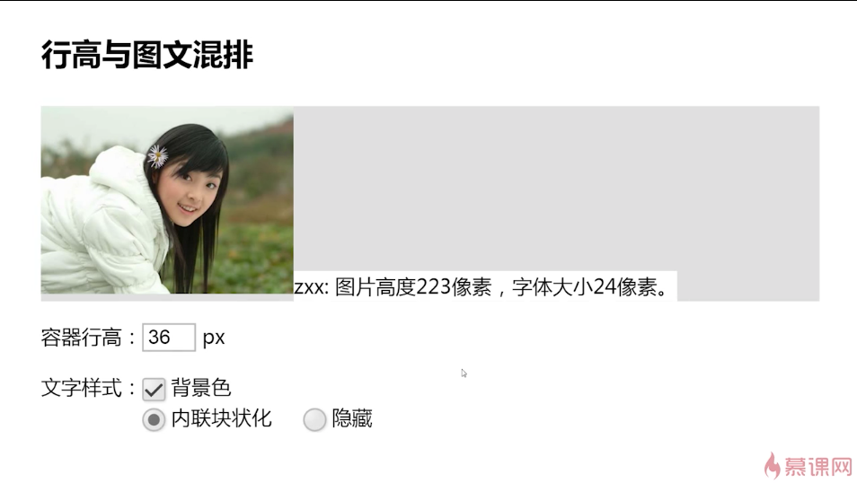

# line-height

所有内联元素的样式表现都与**行内框盒子模型**有关。

## 一、line-height 的组成
```html
<p>这是一行普通的文字，这里有个 <em>em</em> 标签。</p>
```

1. content area(内容区域)
  围绕文字，看不见的盒子，大小与 `font-size` 有关。
2. inline boxes(内联盒子)
  让内容排成一行，如：水平标签（span, a , em等）,纯文字属于「匿名内联盒子」
3. line boxes(行框盒子)
  每一行就是一个「行框盒子」，每个行框盒子由一个个「内联盒子」组成。
4. containing box(包含盒子)
  由一行行「行框盒子」组成。如：<p></p>


> 内联元素的高度 height 由 `line-height` 决定。

## 二、line-height 特点
  1. 行高由于其继承性，影响无处不在，即使单行文本也不例外。
  2. 行高只是幕后黑手，高度表现不是行高，而是「内容区域」和「行间距」。

  > 内容区域(content area) + 行间距(vertical spacing) = 行高(line-height)
  行间距，可大可小，目的就是保证 内联盒子高度 == 行高

内容区域(content area)：
  1. 内容区域高度只与字号(font-size)以及字体(font-family)有关，与line-height没有任何关系。
  2. 在simsun字体下，内容区域高度等于文字大小值。

## 三、line-height 属性值
1. normal
  默认值。跟随浏览器走，与字体元素关联。通常，开始初始化 `body: line-height`
2. `<number>`
  例如：1.5，line-height = 1.5 * font-size；当前元素的 font-size 大小。
3. `<length>`
  例如：1.5em, 150px 等
4. `<percent>`
  例如：150%; 相对于设置了该 `line-height` 属性的元素的 `font-size` 大小。
5. inherit
  默认继承，input 默认为 normal,使用 inherit 可控性更强。

- 区别
  ```css
  xx {
    line-height: 1.5, /* 推荐 */
    line-height: 150%,
    line-height: 1.5em
  }
  ```
1. 计算上，没有区别。
2. 应用元素上，`line-height: 1.5` 所有可继承元素根据 font-size 重计算行高。(继承的是比例)
   `line-height: 150% / 1.5em` 当前元素根据 font-size 计算行高，继承给下面元素。



## 四、line-height 与图片的关系
行高不会影响图片实际占据的高度。

图片下缝隙，由文字与图片基线对齐导致。

隐秘文本节点。



消除间隙
1. 图片块状化，无基线对齐 `img {display: block;}`
2. 图片底线对齐，`img {vertical-align: bottom;}`
3. 行高足够小，基线位置上移 `.box {line-height: 0;}`

小图片，大文字，用 vertical-align 控制图片对齐。


## 五、实战经验
- 设定全局 line-height

```css
body {
  font-size: 14px;
  line-height: ?;
  /* 开发时匹配20px line-height = 20/14 */
  line-height: 1.4286;
}

/* 缩写 */
body {
  font: 14px/1.4286 'microsoft yahei';
}
```

- 图片水平垂直居中(ie8+)
```css
.box {
  line-height: 300px;
  text-align: center;
}

.box > img {
  vertical-align: middle;
}
```

- 多行文本垂直居中(ie8+)
```css
.box {
  line-height: 250px;
  text-align: center;
}

.box > .text {
  display: inline-block;
  line-height: normal;
  text-align: center;
  vertical-align: middle;
}
```

- 文字垂直居中
```css
p {
  line-height: 30px; /*不需要 height*/
}
```


## 六、学习资源
- [张鑫旭：CSS深入理解之line-height](http://www.imooc.com/learn/403)
